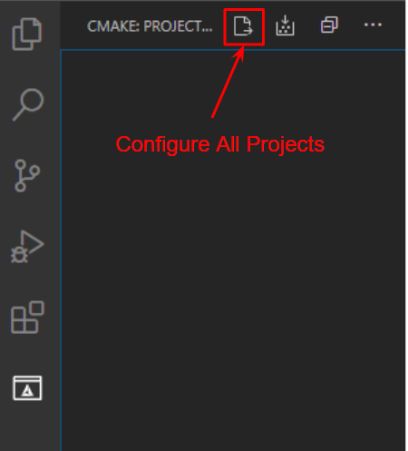
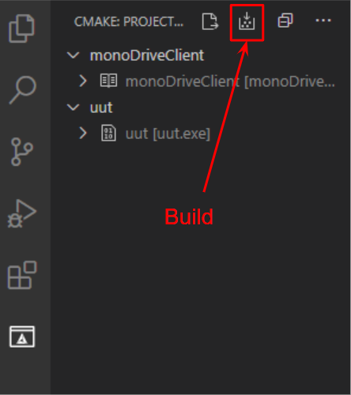

# monoDrive Clients

Collection of monoDrive client software for different languages. 

- [C++](#monodrive-c++-client)
- [ROS](#monodrive-ros-client)

# monoDrive C++ Client

## Windows Prerequisites

- Windows 10
- Visual Studio 2019 Community Edition
- [VSCode](https://code.visualstudio.com/)

### Windows Library Dependencies
Note: Extract or install these libraries to **C:/local** for cmake can find them.

- [Boost](https://sourceforge.net/projects/boost/files/boost-binaries/1.73.0/boost_1_73_0-msvc-14.2-64.exe/download) 
  - Add `C:\local\boost_1_73_0\lib64-msvc-14.2` to your PATH variable
  - Create the `BOOST_ROOT` environment variable and set it to`C:\local\boost_1_73_0\` 

To build the examples the following are required:
- [OpenCV](https://github.com/opencv/opencv/releases/download/4.3.0/opencv-4.3.0-vc14_vc15.exe) Extract to `C:\local\opencv` and add `C:\local\opencv\build\x64\vc15\bin` to your PATH environment variable.
- [Eigen](https://gitlab.com/libeigen/eigen/-/archive/3.3.7/eigen-3.3.7.zip) Extract to `C:\local\Eigen3` and add `C:\local\Eigen3` to your PATH environment variable.

 

## Ubuntu 18.04 Prerequisites
- Ubuntu 18.04
- [VSCode](https://code.visualstudio.com/)
- Install packages: 
    ```bash 
    sudo apt-get install update && sudo apt-get install libboost-dev build-essentials libeigen3-dev
    ```
## VSCode Setup and Build Instructions
1. Open VSCode.
2. Add the following VSCode extensions:
    - CMake
    - CMake Tools
    - C/C++
3. Select `File -> Open Folder` and navigate to this folder to build the cpp-examples or simulator-cpp-client to build just the client library.
4. Use the CMake extension to configure and build
    1. Click the Configure All Projects icon: 

        

    2. If prompted to Scan for Kits select Yes.
    
        *Windows* Choose: `Visual Studio Community 2019 Release - amd64`.
    
        *Linux* Choose: `Choose the compiler of your choice, tested with g++ 7.5.0`.
    
    3. Build the client by clicking the `Build All Projects` icon:
    
        

# monoDrive ROS Client

## Ubuntu 18.04 Prerequisites
- [monoDrive c++ client](https://github.com/monoDriveIO/monodrive-client/blob/master/cpp-client/README.md#monodrive-c++-client)
- [ROS](http://wiki.ros.org/melodic/Installation/Ubuntu) *Note: Tested with melodic*
- ROS Bridge: 
```bash 
sudo apt-get install ros-melodic-rosbridge-suite
````
- ROS Joy:
```bash 
sudo apt-get install ros-melodic-joy
````
### monoDrive ROS Packages and example build

1. Execute the following to build the monoDrive ROS library with:

```bash
cd ./monodrive/ros
catkin_make
source devel/setup.bash
```

2. Add the monoDrive ROS library setup file to your .bashrc to add the packages to your ros path on terminal load:

```bash
echo "source <path/to/monodrive/ros/devel/setup.bash>" >> ~/.bashrc
```

3. Execute the following to build the ROS packages: 
```bash
cd ./examples/ros
catkin_make
source devel/setup.bash
```

4. Add the examples setup file to your .bashrc to add the packages to your ros path on terminal load:
```bash
echo "source <path/to/examples/ros/devel/setup.bash>" >> ~/.bashrc
```

### monoDrive Simulator and Client network setup

*If you are running both the client and simulator on the same machine you can skip this section as the networking defaults are for local host.*

If you are running the simulator and client on separate machines the following networking settings must be configured.

1. Set the IP address and port IDs for the machine running the simulator and the machine running the ros bridge

    - In the configuration file, `simulator_control/confg/simulator.json`, set the IP and port (default is `9090`) of the machine that will host the **ros bridge**:
    ```json
    "ros": {
        "port": 9090,
        "server": "192.168.86.167"
    },
    ```

    - and the IP and port of the **simulator**:

    ```json
    "server_ip": "192.168.86.168",
    "server_port": 8999,
    ```

2. Forward the ports on both machines (`9090` and `8999`) from step 1 or disable the firewalls on both machines.


### Launching the example

3. To launch the monoDrive examples create 3 tabs and run each command in a separate terminal:
    1. Launch rosbridge, you can leave this running: 
    ```bash
    roslaunch rosbridge_server rosbridge_tcp.launch bson_only_mode:=True
    ```
    2. Start the vehicle control node which will subscribe to the state sensor topic and publish vehicle controls (the simulator does not need to be running)
    ```bash
    rosrun vehicle_control node
    ```
    *Note: The vehicle_control example only requires the monodrive_msgs package and provides an example of how to connect your code to monoDrive through ROS messages.*

    3. Make sure the monoDrive simulator is running since the next command will connect to and start the simulator scenario running.
    ```bash
    rosrun simulator_control node
    ```

### Using the G920 Logitech wheel

#### Configuring the Joystick
1. Connect your joystick to your computer. Check if Linux recognized your joystick.
 ```bash
    ls /dev/input/
 ```
 From the list you should see something like this:
 ```
 by-id    event0  event2  event4  event6  event8  mouse0  mouse2  uinput
by-path  event1  event3  event5  event7  js0     mice    mouse1
```

2. Make the joystick accessible to the ROS joy node. Where `jsX` is `js0` from the example above.
```bash
sudo chmod a+rw /dev/input/jsX
```

3. Setup your the jostick device to use on the joy node . Assumig your jostick is `js0`
```bash
rosparam set joy_node/dev "/dev/input/js0"
```
*Optional: You can also specify the deadzone as a parameter*
```bash
rosparam set joy_node/deadzone 0.05
```

#### Launching the example 

To launch the monoDrive examples create 4 tabs and run each command in a separate terminal:   

1. Launch rosbridge, you can leave this running: 
```bash
roslaunch rosbridge_server rosbridge_tcp.launch bson_only_mode:=True
```
2. Start the joy_node.
```
rosrun joy joy_node
```
3. Start the wheel vehicle control node which will subscribe to the state sensor topic and publish vehicle controls (the simulator does not need to be running)
```bash
rosrun wheel_vehicle_control node
```
*Note: The vehicle_control example only requires the monodrive_msgs package and provides an example of how to connect your code to monoDrive through ROS messages.*

4. Make sure the monoDrive simulator is running since the next command will connect to and start the simulator scenario running.
```bash
rosrun simulator_control node
```
    
    
**Note:** The following table show how the buttons in the G920 wheel map to the ROS message.   

<table>
<tr><th>  AXES  </th><th>  BUTTONS  </th></tr>
<tr><td>

| Function   |      ROS message      |
|----------|:-------------:|
| Steering |joy->axes[0] |
| Throttle |joy->axes[1] |
| Brake | joy->axes[2]|
| Clutch | joy->axes[3]|
| Directional pad RIGHT | joy->axes[4]|
| Directional pad LEFT | joy->axes[4]|
| Directional pad UP| joy->axes[5]|
| Directional pad DOWN  | joy->axes[5]|


</td><td>

| Button   |      ROS message      |
|----------|:-------------:|
| A |joy->buttons[0] |
| B |joy->buttons[1] |
| X | joy->buttons[2]|
| Y | joy->buttons[3]|
| RB | joy->buttons[4]|
| LB | joy->buttons[5]|
| Menu button| joy->buttons[6]|
| View button  | joy->buttons[7]|
| RSB | joy->buttons[8]|
| LSB | joy->buttons[9]|
| Xbox button | joy->buttons[10]|   
</td></tr> </table>


    
