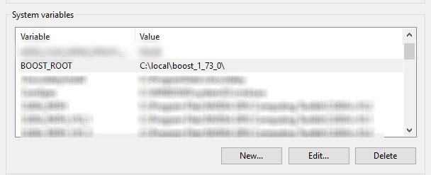
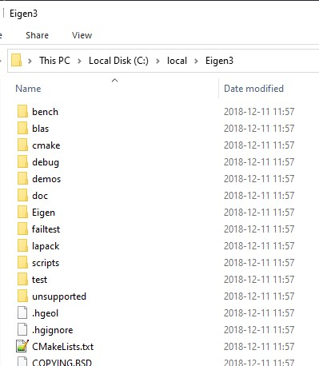
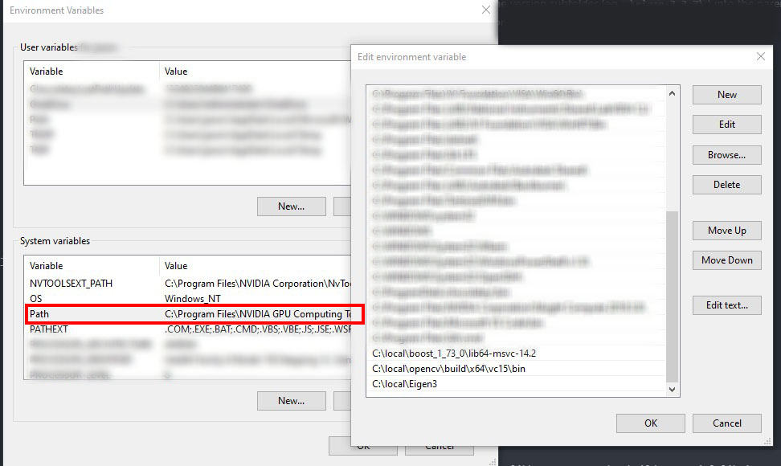
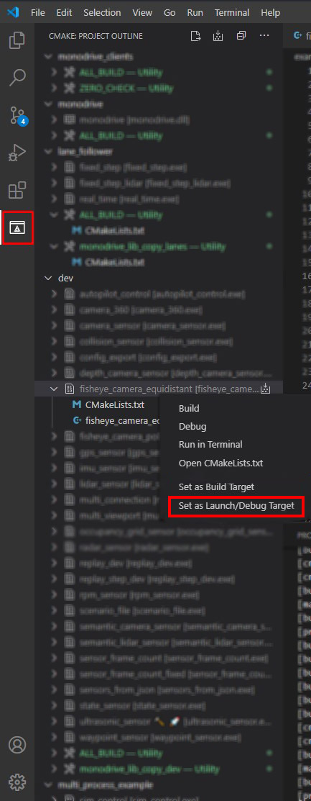
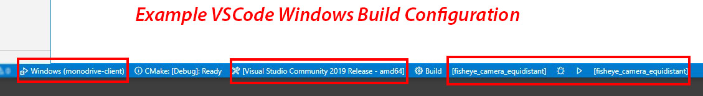

# monoDrive Clients

Collection of monoDrive client software for different languages.

- [C++](#monodrive-c++-client)
- [ROS](#monodrive-ros-client)

# monoDrive C++ Client

## Windows Prerequisites

- Windows 10
- Visual Studio 2019 Community Edition
- [VSCode](https://code.visualstudio.com/)

### Windows Library Dependencies
**NOTE**: Extract or install these libraries to `C:\local` so cmake can find them.

- [Boost](https://sourceforge.net/projects/boost/files/boost-binaries/1.73.0/boost_1_73_0-msvc-14.2-64.exe/download)
  - Add `C:\local\boost_1_73_0\lib64-msvc-14.2` to your PATH variable
  - Create the `BOOST_ROOT` environment variable and set it to `C:\local\boost_1_73_0\`

    


- [CMake](https://cmake.org/download/)
  - When installing, make sure to choose the option to CMake to your Windows Path variable.

To build the examples the following are required:
- [OpenCV](https://github.com/opencv/opencv/releases/download/4.3.0/opencv-4.3.0-vc14_vc15.exe) Extract to `C:\local\opencv` and add `C:\local\opencv\build\x64\vc15\bin` to your PATH environment variable.
- [Eigen](https://gitlab.com/libeigen/eigen/-/archive/3.3.7/eigen-3.3.7.zip) Extract to `C:\local\Eigen3` and add `C:\local\Eigen3` to your PATH environment variable.
  - **NOTE**: You will need to move the extracted contents out of the version subfolder (eg `.\eigen-3.3.7\`) into the parent directory, such that `C:\local\Eigen3\Eigen` is a valid directory path.

    

#### Figure: Environment Variables


## Ubuntu 18.04 Prerequisites
- Ubuntu 18.04
- [VSCode](https://code.visualstudio.com/)
- Run the prerequisite setup script from the root repository directory:
    ```bash
    $ ./util/setup.sh
    ```

## Setup Using VSCode

### Build
1. Open VSCode.

2. Add the following VSCode extensions:
    - [CMake](https://marketplace.visualstudio.com/items?itemName=twxs.cmake)
    - [CMake Tools](https://marketplace.visualstudio.com/items?itemName=ms-vscode.cmake-tools)
    - [C/C++](https://marketplace.visualstudio.com/items?itemName=ms-vscode.cpptools)


3. Select `File -> Open Folder` and navigate to this folder to build the cpp-examples or simulator-cpp-client to build just the client library.
4. Use the CMake extension to configure and build
    1. Click the Configure All Projects icon:

        

    2. If prompted to Scan for Kits select Yes.

        **Windows**: Use `Visual Studio Community 2019 Release - amd64`.

        **Linux**: Use the compiler of your choice. Tested with `g++ 7.5.0`.

    3. Build the client by clicking the `Build All Projects` icon:

        

### Set Launch Target

<p>


**NOTE**: Launching automatically fires off a build check in cmake so just setting the launch target will suffice.


### Run Example
#### Windows



*Example configuration with `fisheye_camera_equidistant` as a build + launch target.*

After you've set your build configuration and target, you can run by hitting `F5` to run in debug or `Ctrl+F5` to run without debugging.

## Installation with CMake
You can include the monoDrive Simulator client in your existing CMake project
by adding the following lines to your `CMakeLists.txt`
```cmake
# add monodrive client library from local repo
add_subdirectory(path/to/monodrive-client/monodrive mdclient)

# link targets as needed
target_link_libraries(<mytarget> monodrive)
```


## Installation with Bazel
You can include the monoDrive Simulator client in your existing Bazel project
by adding the following lines to your `WORKSPACE` file
```
local_repository(
    name = "monodrive",
    path = "path/to/monodrive-client"
)
```
and the following to your `BUILD` files as needed
```
cc_library(
    name = "my_lib",
    srcs = [...],
    hdrs = [...],
    deps = [
        ...,
        "@monodrive//monodrive/core:monodrive"
    ]
)
```


## Installation to system on Ubuntu
You can build and install the monoDrive Simulator client to your Ubuntu system
using CMake
```
mkdir build
cd build
cmake ..
make
sudo make install
```

This will install the client library under the prefix `/usr/local/monodrive/client`.
It can now be included or linked as needed.

For example, to compile your own executable with the monoDrive client library
```
g++ main.cpp -I/usr/local/monodrive/client/include/ -L/usr/local/monodrive/client/lib -lboost_system -lmonodrive -o my_program
```

Make library available for dynamic loading
```
export LD_LIBRARY_PATH=${LD_LIBRARY_PATH}:/usr/local/monodrive/client/lib
```

Finally run
```
./my_program
```


# monoDrive ROS Client
There are two ways to integrate the monoDrive simulator with ROS.

The first is to configure the sensors to publish data directly to ROS instead of usng TCP streams. This is supported for
IMU, Waypoint, State, Camera and Lidar sensors. The `simulator_control`, `vehicle_control`, and`wheel_vehicle_control`
examples demonstrate how to do this.

The second is using TCP/IP streams to receive sensor data, converting that data on a frame by frame basis to ROS
messages, and publishing those on the desired ROS topic. To support this approach, there is a message conversion utility
class in `monodrive/ros/src/monodrive_msgs/include/MessageFactory.h` that facilitates converting raw sensor frame data to
ROS messages and vice-versa. The `distributed` ROS example demonstrates how to use this approach.


## Ubuntu 18.04 Prerequisites
- [monoDrive c++ client](https://github.com/monoDriveIO/monodrive-client/blob/master/README.md#monodrive-c++-client)
- [ROS](http://wiki.ros.org/melodic/Installation/Ubuntu) *Note: Tested with melodic*
- ROS Bridge:
```bash
sudo apt-get install ros-melodic-rosbridge-suite
````
- ROS Joy:
```bash
sudo apt-get install ros-melodic-joy
````
### monoDrive ROS Packages and example build

1. Execute the following to build the monoDrive ROS library with:

```bash
cd ./monodrive/ros
catkin_make
source devel/setup.bash
```

2. Add the monoDrive ROS library setup file to your .bashrc to add the packages to your ros path on terminal load:

```bash
echo "source <path/to/monodrive/ros/devel/setup.bash>" >> ~/.bashrc
```

3. Execute the following to build the ROS packages:
```bash
cd ./examples/ros
catkin_make
source devel/setup.bash
```

4. Add the examples setup file to your .bashrc to add the packages to your ros path on terminal load:
```bash
echo "source <path/to/examples/ros/devel/setup.bash>" >> ~/.bashrc
```

### monoDrive Simulator and Client network setup for the the direct-to-ROS examples

*If you are running both the client and simulator on the same machine you can skip this section as the networking defaults are for local host.*

If you are running the simulator and client on separate machines the following networking settings must be configured.

1. Set the IP address and port IDs for the machine running the simulator and the machine running the ros bridge

    - In the configuration file, `simulator_control/confg/simulator.json`, set the IP and port (default is `9090`) of the machine that will host the **ros bridge**:
    ```json
    "ros": {
        "port": 9090,
        "server": "192.168.86.167"
    },
    ```

    - and the IP and port of the **simulator**:

    ```json
    "server_ip": "192.168.86.168",
    "server_port": 8999,
    ```

2. Forward the ports on both machines (`9090` and `8999`) from step 1 or disable the firewalls on both machines.


### Launching the direct-to-ROS examples

3. To launch the monoDrive examples create 3 tabs and run each command in a separate terminal:
    1. Launch rosbridge, you can leave this running:
    ```bash
    roslaunch rosbridge_server rosbridge_tcp.launch bson_only_mode:=True
    ```
    2. Start the vehicle control node which will subscribe to the state sensor topic and publish vehicle controls (the simulator does not need to be running)
    ```bash
    rosrun vehicle_control node
    ```
    *Note: The vehicle_control example only requires the monodrive_msgs package and provides an example of how to connect your code to monoDrive through ROS messages.*

    3. Make sure the monoDrive simulator is running since the next command will connect to and start the simulator scenario running.
    ```bash
    rosrun simulator_control node
    ```

### Launching the message conversion to ROS example

4. To launch the monoDrive example create 3 tabs and run each command in a separate terminal:
    1. Make sure the monoDrive simulator is running since the run command will connect to and start the simulator scenario running.
    ```bash
    rosrun distributed node
    ```

### Using the G920 Logitech wheel

#### Configuring the Joystick
1. Connect your joystick to your computer. Check if Linux recognized your joystick.
 ```bash
    ls /dev/input/
 ```
 From the list verify that you can see `jx0` or `jsX` in the list, this will mean Linux recognize your joystick.

2. Make the joystick accessible to the ROS joy node. Where `jsX` is `js0` from the example above.
```bash
sudo chmod a+rw /dev/input/jsX
```

3. Setup your the joystick device to use on the joy node . Assumig your joystick is `js0`
```bash
rosparam set joy_node/dev "/dev/input/js0"
```
*Optional: You can also specify the deadzone as a parameter*
```bash
rosparam set joy_node/deadzone 0.05
```

#### Launching the example

To launch the monoDrive examples create 4 tabs and run each command in a separate terminal:   

1. Launch rosbridge, you can leave this running:
```bash
roslaunch rosbridge_server rosbridge_tcp.launch bson_only_mode:=True
```
2. Start the joy_node.
```
rosrun joy joy_node
```
3. Start the wheel vehicle control node which will subscribe to the state sensor topic and publish vehicle controls (the simulator does not need to be running)
```bash
rosrun wheel_vehicle_control node
```
*Note: The vehicle_control example only requires the monodrive_msgs package and provides an example of how to connect your code to monoDrive through ROS messages.*

4. Make sure the monoDrive simulator is running since the next command will connect to and start the simulator scenario running.
```bash
rosrun simulator_control node
```


**Note:** The following table show how the buttons in the G920 wheel map to the ROS message.   

<table>
<tr><th>  AXES  </th><th>  BUTTONS  </th></tr>
<tr><td>

| Function   |      ROS message      |
|----------|:-------------:|
| Steering |joy->axes[0] |
| Throttle |joy->axes[1] |
| Brake | joy->axes[2]|
| Clutch | joy->axes[3]|
| Directional pad RIGHT | joy->axes[4]|
| Directional pad LEFT | joy->axes[4]|
| Directional pad UP| joy->axes[5]|
| Directional pad DOWN  | joy->axes[5]|


</td><td>

| Button   |      ROS message      |
|----------|:-------------:|
| A |joy->buttons[0] |
| B |joy->buttons[1] |
| X | joy->buttons[2]|
| Y | joy->buttons[3]|
| RB | joy->buttons[4]|
| LB | joy->buttons[5]|
| Menu button| joy->buttons[6]|
| View button  | joy->buttons[7]|
| RSB | joy->buttons[8]|
| LSB | joy->buttons[9]|
| Xbox button | joy->buttons[10]|   
</td></tr> </table>
