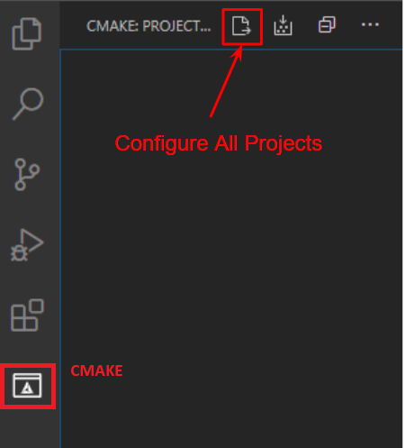

# monoDrive Clients

Collection of monoDrive client software for different languages. 

- [C++](#monodrive-c++-client)
- [ROS](#monodrive-ros-client)

# monoDrive C++ Client

## Windows Prerequisites

- Windows 10
- Visual Studio 2019 Community Edition
- [VSCode](https://code.visualstudio.com/)

### Windows Library Dependencies
Note: Extract or install these libraries to **C:/local** for cmake can find them.

- [Boost](https://sourceforge.net/projects/boost/files/boost-binaries/1.73.0/boost_1_73_0-msvc-14.2-64.exe/download) Add `C:\local\boost_1_73_0\lib64-msvc-14.2` to your path.

To build the examples the following are required:
- [OpenCV](https://github.com/opencv/opencv/releases/download/4.3.0/opencv-4.3.0-vc14_vc15.exe) Extract to `C:\local\opencv` and add `C:\local\opencv\build\x64\vc15\bin` to your path.
- [Eigen](https://gitlab.com/libeigen/eigen/-/archive/3.3.7/eigen-3.3.7.zip) Extract to `C:\local\Eigen3` and add `C:\local\Eigen3` to your path.

 

## Ubuntu 18.04 Prerequisites
- Ubuntu 18.04
- [VSCode](https://code.visualstudio.com/)
- Install packages: 
    ```bash 
    sudo apt-get install update && sudo apt-get install libboost-dev build-essentials libeigen3-dev
    ```
## VSCode Setup and Build Instructions
1. Open VSCode.
2. Add the following VSCode extensions:
    - CMake
    - CMake Tools
    - C/C++
3. Select `File -> Open Folder` and navigate to this folder to build the cpp-examples or simulator-cpp-client to build just the client library.
4. Use the CMake extension to configure and build
    1. Click the Configure All Projects icon: 

        

    2. If prompted to Scan for Kits select Yes.
    
        *Windows* Choose: `Visual Studio Community 2019 Release - amd64`.
    
        *Linux* Choose: `Choose the compiler of your choice, tested with g++ 7.5.0`.
    
    3. Build the client by clicking the `Build All Projects` icon:
    
        


## Installation with CMake
You can include the monoDrive Simulator client in your existing CMake project
by adding the following lines to your `CMakeLists.txt`
```cmake
# add monodrive client library from local repo
add_subdirectory(path/to/monodrive-client/monodrive mdclient)

# link targets as needed
target_link_libraries(<mytarget> monodrive)
```


## Installation with Bazel
You can include the monoDrive Simulator client in your existing Bazel project
by adding the following lines to your `WORKSPACE` file
```
local_repository(
    name = "monodrive",
    path = "path/to/monodrive-client"
)
```
and the following to your `BUILD` files as needed
```
cc_library(
    name = "my_lib",
    srcs = [...],
    hdrs = [...],
    deps = [
        ...,
        "@monodrive//monodrive/core:monodrive"
    ]
)
```


## Installation to system on Ubuntu
You can build and install the monoDrive Simulator client to your Ubuntu system
using CMake
```
mkdir build
cd build
cmake ..
make
sudo make install
```

This will install the client library under the prefix `/usr/local/monodrive/client`.
It can now be included or linked as needed.

For example, to compile your own executable with the monoDrive client library
```
g++ main.cpp -I/usr/local/monodrive/client/include/ -L/usr/local/monodrive/client/lib -lboost_system -lmonodrive -o my_program
```

Make library available for dynamic loading
```
export LD_LIBRARY_PATH=${LD_LIBRARY_PATH}:/usr/local/monodrive/client/lib
```

Finally run
```
./my_program
```


# monoDrive ROS Client

## Ubuntu 18.04 Prerequisites
- [monoDrive c++ client](https://github.com/monoDriveIO/monodrive-client/blob/master/cpp-client/README.md#monodrive-c++-client)
- [ROS](http://wiki.ros.org/melodic/Installation/Ubuntu) *Note: Tested with melodic*
- ROS Bridge: 
```bash 
sudo apt-get install ros-melodic-rosbridge-suite
````

### monoDrive ROS Packages and example build

1. Execute the following to build the monoDrive ROS library with:

```bash
cd ./monodrive/ros
catkin_make
source devel/setup.bash
```

2. Add the monoDrive ROS library setup file to your .bashrc to add the packages to your ros path on terminal load:

```bash
echo "source <path/to/monodrive/ros/devel/setup.bash>" >> ~/.bashrc

1. Execute the following to build the ROS packages: 
```bash
cd ./examples/ros
catkin_make
source devel/setup.bash
```

1. Add the examples setup file to your .bashrc to add the packages to your ros path on terminal load:
```bash
echo "source <path/to/examples/ros/devel/setup.bash>" >> ~/.bashrc
```

### monoDrive Simulator and Client network setup

*If you are running both the client and simulator on the same machine you can skip this section as the networking defaults are for local host.*

If you are running the simulator and client on separate machines the following networking settings must be configured.

1. Set the IP address and port IDs for the machine running the simulator and the machine running the ros bridge

    - In the configuration file, `simulator_control/confg/simulator.json`, set the IP and port (default is `9090`) of the machine that will host the **ros bridge**:
    ```json
    "ros": {
        "port": 9090,
        "server": "192.168.86.167"
    },
    ```

    - and the IP and port of the **simulator**:

    ```json
    "server_ip": "192.168.86.168",
    "server_port": 8999,
    ```

2. Forward the ports on both machines (`9090` and `8999`) from step 1 or disable the firewalls on both machines.


### Launching the example

4. To launch the monoDrive examples create 3 tabs and run each command in a separate terminal:
    1. Launch rosbridge, you can leave this running: 
    ```bash
    roslaunch rosbridge_server rosbridge_tcp.launch bson_only_mode:=True
    ```
    2. Start the vehicle control node which will subscribe to the state sensor topic and publish vehicle controls (the simulator does not need to be running)
    ```bash
    rosrun vehicle_control node
    ```
    *Note: The vehicle_control example only requires the monodrive_msgs package and provides an example of how to connect your code to monoDrive through ROS messages.*

    3. Make sure the monoDrive simulator is running since the next command will connect to and start the simulator scenario running.
    ```bash
    rosrun simulator_control node
    ```